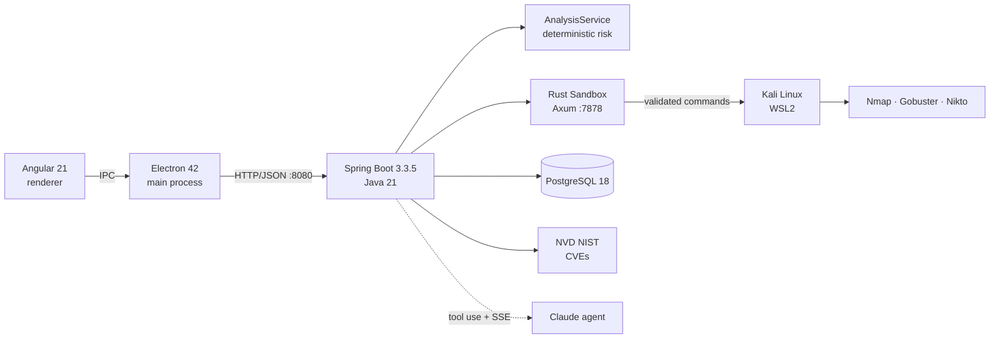
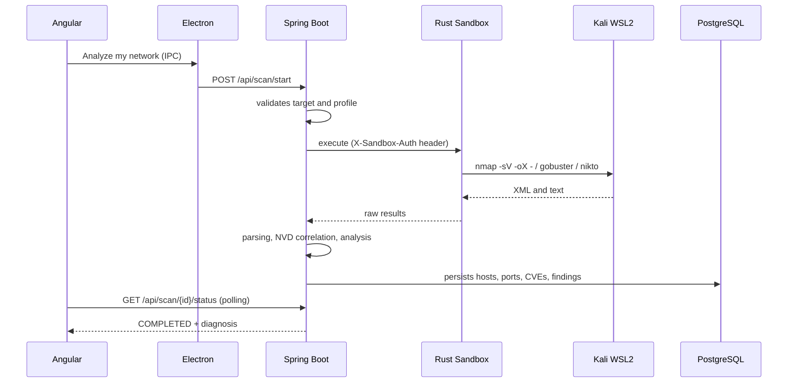

<div align="center">


# NetSentinel

### Network security analyzer for non-technical users: scans your network, detects vulnerabilities, and delivers a plain-language diagnosis with step-by-step instructions to fix each problem.

[](../../actions)
[](../../releases)
[](#prerequisites)
[](#stack)
[](#stack)

[**Download installer**](https://github.com/FaridDevU/NetSentinel/releases/tag/v0.1.0) · [**Architecture**](#architecture) · [**Report a bug**](../../issues)

</div>

---

## Quickstart

There are no commands for the end user. The full flow is:

1. Download `NetSentinel.Setup.0.1.0.exe` from the [release](https://github.com/FaridDevU/NetSentinel/releases/tag/v0.1.0).
2. Install with a double click and open the app.
3. Press **Complete installation** and approve the UAC prompt. The installer enables WSL2 and installs Kali Linux, the tools, the database, the backend and the sandbox in a guided way.
4. Press **Analyze my network** and read the diagnosis.

The backend exposes a local REST API at `http://localhost:8080`. A scan is started like this:

```bash
curl -X POST http://localhost:8080/api/scan/start \
  -H "Content-Type: application/json" \
  -d '{"target": "192.168.1.0/24", "parameters": ["ESTANDAR"]}'
```

```json
{ "id": "a1b2c3d4-0000-0000-0000-000000000000", "target": "192.168.1.0/24", "status": "PENDING" }
```

---

## Table of contents
- [Why this project](#why-this-project)
- [Features](#features)
- [Architecture](#architecture)
- [Stack](#stack)
- [Installation](#installation)
- [Usage](#usage)
- [API](#api)
- [Tests](#tests)
- [Project structure](#project-structure)
- [Roadmap](#roadmap)
- [License](#license)

---

## Why this project

Most network security tools (Nmap, Nikto, Gobuster, Metasploit) are powerful but require technical knowledge: interpreting ports, services, versions and CVEs. NetSentinel closes that gap. It packages a complete Kali Linux environment inside a Windows desktop app, runs the tools in a controlled sandbox, and translates the results into an actionable, plain-language diagnosis. The goal is for anyone to be able to audit their own network with a single button, without opening a terminal or installing dependencies by hand.

The project has two complementary parts:

- **Part 1 — Standalone app.** Scanning, vulnerability detection and deterministic diagnosis. No API key and no connection to external AI services required.
- **Part 2 — Claude agent.** A conversational security consultant that orchestrates the system through tool use: launches scans, reads results, cross-references information between hosts, and guides the user step by step.

---

## Features

- **Guided one-click installation** — enables WSL2 and installs Kali Linux, the tools, PostgreSQL, the backend and the sandbox with no manual commands.
- **Scanning in an isolated sandbox** — a Rust service validates every command and tool before running it inside Kali, with token authentication.
- **Plain-language diagnosis** — a deterministic analysis engine that computes a risk level from 0 to 10 and concrete recommendations, without relying on external AI.
- **CVE correlation** — queries the NIST NVD database for each detected service and version.
- **Optional AI agent** — a conversational consultant based on the Claude API with tool use and SSE streaming.
- **Report export** — PDF, JSON and CSV; comparison between scans and history.
- **Scan profiles** — `RAPIDO`, `ESTANDAR` and `COMPLETO`.
- **CI** — GitHub Actions runs the backend, sandbox and frontend tests on every push.

---

## Architecture

NetSentinel is organized into five layers. Electron is the desktop process; Angular is the interface; Spring Boot coordinates the logic; the Rust sandbox runs the tools inside Kali on WSL2; PostgreSQL persists the data.



<details>
<summary><b>View a scan's flow</b></summary>


</details>

> Full detail of the layers and technical decisions in the project documentation vault.

---

## Stack

| Layer | Technology |
|---|---|
| Desktop app | Electron 42 |
| Interface | Angular 21 + TypeScript |
| Backend | Spring Boot 3.3.5 + Java 21 |
| Sandbox | Rust (Axum 0.7 + Tokio) |
| Embedded Linux | WSL2 + Kali Linux |
| Tools | Nmap, Gobuster, Nikto |
| Database | PostgreSQL 18 (Flyway for migrations) |
| Installer | NSIS + PowerShell (`setup.ps1`) |
| AI agent | Claude API (`claude-sonnet-4-6`, tool use + SSE) |
| CVE source | NVD NIST |
| CI | GitHub Actions |

---

## Installation

### Prerequisites

- Windows 10 / 11 with virtualization enabled (for WSL2).
- For development: Java 21 (JDK), Node 20+, Rust (stable toolchain) and PostgreSQL 18.

### End user

Download and install `NetSentinel.Setup.0.1.0.exe` from the [release](https://github.com/FaridDevU/NetSentinel/releases/tag/v0.1.0). The installer resolves WSL2, Kali and all dependencies in a guided way.

<details>
<summary><b>Build from source</b></summary>

```bash
git clone https://github.com/FaridDevU/NetSentinel.git
cd NetSentinel

cd backend
mvn clean package

cd ../sandbox
cargo build --release

cd ../frontend
npm install
npm run electron:build
```

The generated installer ends up in `frontend/dist-installer/`.
</details>

---

## Usage

From the app: open it, press **Analyze my network**, wait for the scan to reach `COMPLETED`, and review the dashboard, the findings by severity, and the recommendations. Results can be exported to PDF, JSON or CSV, compared against previous scans, and consulted in the history.

Against the local API, a full scan cycle:

```bash
curl -X POST http://localhost:8080/api/scan/start \
  -H "Content-Type: application/json" \
  -d '{"target": "127.0.0.1", "parameters": ["RAPIDO"]}'

curl http://localhost:8080/api/scan/{id}/status

curl http://localhost:8080/api/scan/{id}/results
```

---

## API

Local REST API served by the backend at `http://localhost:8080`. Main endpoints:

| Method | Path | Description |
|---|---|---|
| GET | /api/health | Status of the backend, database and sandbox |
| POST | /api/scan/start | Starts a scan (target + profile) |
| GET | /api/scan/{id}/status | Status of a scan |
| GET | /api/scan/{id}/results | Full results |
| POST | /api/scan/{id}/cancel | Cancels a scan in progress |
| DELETE | /api/scan/{id} | Deletes a scan |
| GET | /api/scan/{id}/logs | Scan logs |
| GET | /api/scan/{id}/export/pdf | Exports the report as PDF |
| GET | /api/scan/{id}/export/json | Exports the report as JSON |
| GET | /api/scan/{id}/export/csv | Exports the report as CSV |
| GET | /api/scan/compare | Compares two scans |
| GET | /api/history | Paginated scan history |
| GET | /api/network/local | Detected local networks |
| GET | /api/dashboard | Dashboard summary |
| GET | /api/assets | Inventory of detected assets |
| GET | /api/scan/{scanId}/findings/statuses | Status of the findings |
| PUT | /api/scan/{scanId}/findings/status | Updates the status of a finding |
| POST | /api/agent/chat | Chat with the Claude agent (SSE) |

---

## Tests

```bash
cd backend && mvn test
cd sandbox && cargo test
cd frontend && npm test -- --no-watch
```

Current coverage: backend with unit and integration tests (`ScanServiceIntegrationTest` with Testcontainers), sandbox with command and target validation tests, and a frontend suite. CI runs them on every push.

---

## Project structure


---

## Roadmap

- [x] Scanning, parsing and deterministic analysis
- [x] Rust sandbox with validation and an authentication token
- [x] CVE correlation with NVD
- [x] Guided installer (NSIS + setup.ps1)
- [x] Claude agent with tool use and SSE
- [x] PDF / JSON / CSV export and history
- [ ] Installer validation on a clean machine/VM and promotion of the release to stable
- [ ] Network topology map (Cytoscape.js)
- [ ] Sandbox hardening at the OS level (Landlock / Job Objects)
- [ ] Job queue with Redis

See the [open issues](../../issues) for the details.

---

## License

Distributed under the MIT license. See [`LICENSE`](LICENSE).

[](LICENSE)

<div align="center">
<sub>Repository: <a href="https://github.com/FaridDevU/NetSentinel">github.com/FaridDevU/NetSentinel</a></sub>

<a href="#netsentinel">Back to top</a>
</div>
