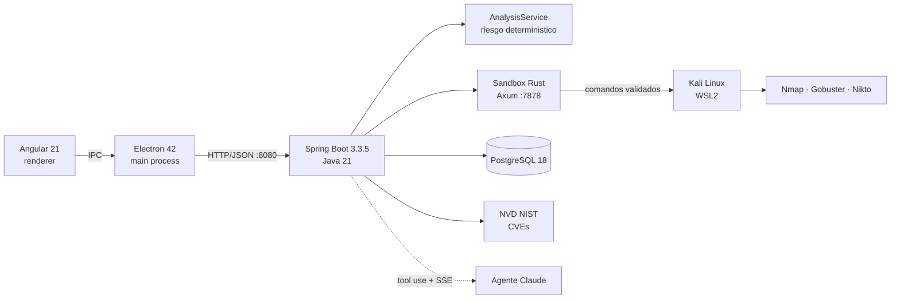
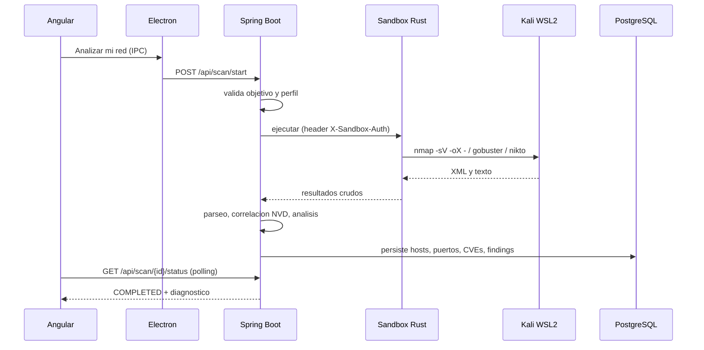

<div align="center">


# NetSentinel

### Analizador de seguridad de red para usuarios no tecnicos: escanea tu red, detecta vulnerabilidades y entrega un diagnostico en lenguaje simple con instrucciones para resolver cada problema.

[](../../actions)
[](../../releases)
[](#requisitos-previos)
[](#stack)
[](#stack)

[**Descargar instalador**](https://github.com/FaridDevU/NetSentinel/releases/tag/v0.1.0) · [**Arquitectura**](#arquitectura) · [**Reportar bug**](../../issues)

</div>

---

## Quickstart

Para el usuario final no hay comandos. El flujo completo es:

1. Descargar `NetSentinel.Setup.0.1.0.exe` desde el [release](https://github.com/FaridDevU/NetSentinel/releases/tag/v0.1.0).
2. Instalar con doble clic y abrir la aplicacion.
3. Pulsar **Completar instalacion** y aprobar el UAC. El instalador habilita WSL2, instala Kali Linux, las herramientas, la base de datos, el backend y el sandbox de forma guiada.
4. Pulsar **Analizar mi red** y leer el diagnostico.

El backend expone una API REST local en `http://localhost:8080`. Un escaneo se inicia asi:

```bash
curl -X POST http://localhost:8080/api/scan/start \
  -H "Content-Type: application/json" \
  -d '{"target": "192.168.1.0/24", "parameters": ["ESTANDAR"]}'
```

```json
{ "id": "a1b2c3d4-0000-0000-0000-000000000000", "target": "192.168.1.0/24", "status": "PENDING" }
```

---

## Tabla de contenidos
- [Por que este proyecto](#por-que-este-proyecto)
- [Caracteristicas](#caracteristicas)
- [Arquitectura](#arquitectura)
- [Stack](#stack)
- [Instalacion](#instalacion)
- [Uso](#uso)
- [API](#api)
- [Tests](#tests)
- [Estructura del proyecto](#estructura-del-proyecto)
- [Roadmap](#roadmap)
- [Licencia](#licencia)

---

## Por que este proyecto

La mayoria de las herramientas de seguridad de red (Nmap, Nikto, Gobuster, Metasploit) son potentes pero exigen conocimiento tecnico: interpretar puertos, servicios, versiones y CVEs. NetSentinel cierra esa brecha. Empaqueta un entorno Kali Linux completo dentro de una aplicacion de escritorio para Windows, ejecuta las herramientas en un sandbox controlado y traduce los resultados a un diagnostico accionable en espanol. El objetivo es que cualquier persona pueda auditar su propia red con un solo boton, sin abrir una terminal ni instalar dependencias a mano.

El proyecto tiene dos partes complementarias:

- **Parte 1 — App standalone.** Escaneo, deteccion de vulnerabilidades y diagnostico deterministico. No requiere clave de API ni conexion a servicios externos de IA.
- **Parte 2 — Agente Claude.** Un consultor de seguridad conversacional que orquesta el sistema mediante tool use: lanza escaneos, lee resultados, cruza informacion entre hosts y guia al usuario paso a paso.

---

## Caracteristicas

- **Instalacion guiada de un clic** — habilita WSL2 e instala Kali Linux, herramientas, PostgreSQL, backend y sandbox sin comandos manuales.
- **Escaneo en sandbox aislado** — un servicio en Rust valida cada comando y herramienta antes de ejecutarlo dentro de Kali, con autenticacion por token.
- **Diagnostico en lenguaje humano** — motor de analisis deterministico que calcula un nivel de riesgo de 0 a 10 y recomendaciones concretas en espanol, sin depender de IA externa.
- **Correlacion de CVEs** — consulta la base NVD del NIST para cada servicio y version detectados.
- **Agente de IA opcional** — consultor conversacional basado en la API de Claude con tool use y streaming SSE.
- **Exportacion de reportes** — PDF, JSON y CSV; comparacion entre escaneos e historial.
- **Perfiles de escaneo** — `RAPIDO`, `ESTANDAR` y `COMPLETO`.
- **CI** — GitHub Actions ejecuta los tests de backend, sandbox y frontend en cada push.

---

## Arquitectura

NetSentinel se organiza en cinco capas. Electron es el proceso de escritorio; Angular es la interfaz; Spring Boot coordina la logica; el sandbox en Rust ejecuta las herramientas dentro de Kali en WSL2; PostgreSQL persiste los datos.



<details>
<summary><b>Ver flujo de un escaneo</b></summary>


</details>

> Detalle completo de capas y decisiones tecnicas en la boveda de documentacion del proyecto.

---

## Stack

| Capa | Tecnologia |
|---|---|
| App de escritorio | Electron 42 |
| Interfaz | Angular 21 + TypeScript |
| Backend | Spring Boot 3.3.5 + Java 21 |
| Sandbox | Rust (Axum 0.7 + Tokio) |
| Linux embebido | WSL2 + Kali Linux |
| Herramientas | Nmap, Gobuster, Nikto |
| Base de datos | PostgreSQL 18 (Flyway para migraciones) |
| Instalador | NSIS + PowerShell (`setup.ps1`) |
| Agente IA | API de Claude (`claude-sonnet-4-6`, tool use + SSE) |
| Fuente de CVEs | NVD NIST |
| CI | GitHub Actions |

---

## Instalacion

### Requisitos previos

- Windows 10 / 11 con virtualizacion habilitada (para WSL2).
- Para desarrollo: Java 21 (JDK), Node 20+, Rust (toolchain estable) y PostgreSQL 18.

### Usuario final

Descargar e instalar `NetSentinel.Setup.0.1.0.exe` desde el [release](https://github.com/FaridDevU/NetSentinel/releases/tag/v0.1.0). El instalador resuelve WSL2, Kali y todas las dependencias de forma guiada.

<details>
<summary><b>Compilacion desde codigo fuente</b></summary>

```bash
git clone https://github.com/FaridDevU/NetSentinel.git
cd NetSentinel

cd backend
mvn clean package

cd ../sandbox
cargo build --release

cd ../frontend
npm install
npm run electron:build
```

El instalador generado queda en `frontend/dist-installer/`.
</details>

---

## Uso

Desde la aplicacion: abrir, pulsar **Analizar mi red**, esperar a que el escaneo pase a `COMPLETED` y revisar el dashboard, los hallazgos por severidad y las recomendaciones. Los resultados se pueden exportar a PDF, JSON o CSV, comparar contra escaneos previos y consultar en el historial.

Contra la API local, un ciclo completo de escaneo:

```bash
curl -X POST http://localhost:8080/api/scan/start \
  -H "Content-Type: application/json" \
  -d '{"target": "127.0.0.1", "parameters": ["RAPIDO"]}'

curl http://localhost:8080/api/scan/{id}/status

curl http://localhost:8080/api/scan/{id}/results
```

---

## API

API REST local servida por el backend en `http://localhost:8080`. Endpoints principales:

| Metodo | Ruta | Descripcion |
|---|---|---|
| GET | /api/health | Estado del backend, base de datos y sandbox |
| POST | /api/scan/start | Inicia un escaneo (objetivo + perfil) |
| GET | /api/scan/{id}/status | Estado de un escaneo |
| GET | /api/scan/{id}/results | Resultados completos |
| POST | /api/scan/{id}/cancel | Cancela un escaneo en curso |
| DELETE | /api/scan/{id} | Elimina un escaneo |
| GET | /api/scan/{id}/logs | Logs del escaneo |
| GET | /api/scan/{id}/export/pdf | Exporta el reporte en PDF |
| GET | /api/scan/{id}/export/json | Exporta el reporte en JSON |
| GET | /api/scan/{id}/export/csv | Exporta el reporte en CSV |
| GET | /api/scan/compare | Compara dos escaneos |
| GET | /api/history | Historial paginado de escaneos |
| GET | /api/network/local | Redes locales detectadas |
| GET | /api/dashboard | Resumen para el dashboard |
| GET | /api/assets | Inventario de activos detectados |
| GET | /api/scan/{scanId}/findings/statuses | Estado de los hallazgos |
| PUT | /api/scan/{scanId}/findings/status | Actualiza el estado de un hallazgo |
| POST | /api/agent/chat | Chat con el agente Claude (SSE) |

---

## Tests

```bash
cd backend && mvn test
cd sandbox && cargo test
cd frontend && npm test -- --no-watch
```

Cobertura actual: backend con tests unitarios y de integracion (`ScanServiceIntegrationTest` con Testcontainers), sandbox con tests de validacion de comandos y objetivos, y suite de frontend. La CI los ejecuta en cada push.

---

## Estructura del proyecto


---

## Roadmap

- [x] Escaneo, parseo y analisis deterministico
- [x] Sandbox en Rust con validacion y token de autenticacion
- [x] Correlacion de CVEs con NVD
- [x] Instalador guiado (NSIS + setup.ps1)
- [x] Agente Claude con tool use y SSE
- [x] Exportacion PDF / JSON / CSV e historial
- [ ] Validacion del instalador en maquina/VM limpia y promocion del release a estable
- [ ] Mapa de topologia de red (Cytoscape.js)
- [ ] Endurecimiento del sandbox a nivel SO (Landlock / Job Objects)
- [ ] Cola de jobs con Redis

Ver los [issues abiertos](../../issues) para el detalle.

---

## Licencia

Distribuido bajo licencia MIT. Ver [`LICENSE`](LICENSE).

[](LICENSE)

<div align="center">
<sub>Repositorio: <a href="https://github.com/FaridDevU/NetSentinel">github.com/FaridDevU/NetSentinel</a></sub>

<a href="#netsentinel">Volver arriba</a>
</div>
